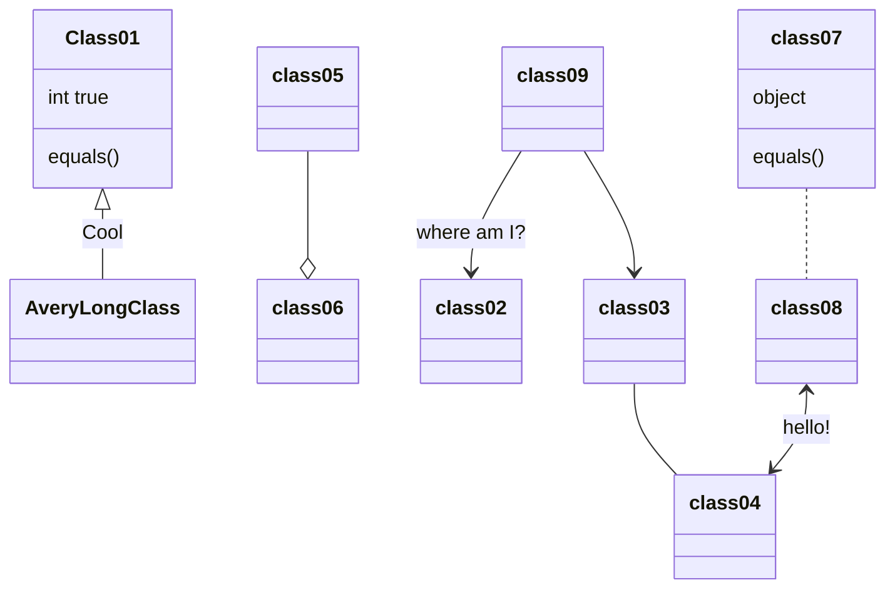

[TOC]
# 如何使用vscode写笔记？

## 有用的参考资料

 [基本元素（公式、流程图、图片）编辑方式文档](https://shd101wyy.github.io/markdown-preview-enhanced/#/zh-cn/diagrams?id=flow-charts)

 [一个非常有用的教学文档](https://orangex4.cool/post/notes-in-markdown/#%E4%BF%AE%E6%94%B9%E9%A2%84%E8%A7%88%E7%AA%97%E5%8F%A3%E8%83%8C%E6%99%AF-%E9%80%89%E5%81%9A)
 
 [latex常用符号](https://blog.csdn.net/ViatorSun/article/details/82826664?ops_request_misc=%257B%2522request%255Fid%2522%253A%2522162306595616780261931583%2522%252C%2522scm%2522%253A%252220140713.130102334..%2522%257D&request_id=162306595616780261931583&biz_id=0&utm_medium=distribute.pc_search_result.none-task-blog-2~all~top_positive~default-1-82826664.pc_search_result_before_js&utm_term=latex&spm=1018.2226.3001.4187)

---
## 基本操作
 1. 插入公式: $x^2+y^2=1$
 2. 修改字体类型和颜色
   ```markdown
  <font face="逐浪新宋" color=red size=3>我是逐浪新宋</font>  //特点是可以更改大小
  <font style="color:white;background:red;">背景</font> //特点是可以高亮
   ```
   example: 
    - <font face="楷体" color=red size=4>我是红色楷体</font>
    - <font style="face:'楷体'；color:white;background:red;">背景</font>

 3. 插入图片（可以粘贴截图：ctr+alt+v)
 4. 插入表格
   
  |项目1|项目2|
  |-|-|
  |奖学金|诺贝尔奖|

 5. 流程图等各种图
   ```mermaid
   graph LR
   A-->B
   B-->c
   c-->A
   ```
 6. 用@import导入外部文件
      @import "1.png"
1. 可以在编写过程中运行代码，画出一些图形
---
#制作PPT
优点：
1. 可以插入函数图形、公式、流程图等
2. 无需考虑排版问题
缺点：
1. 需要时间学习；
2. 只能在浏览器中展示
   

与powerpoint对比，大多数情况下它的实用性更低，所以制作ppt使用powerpoint

---

# 几种绘图
[mermaid支持的绘图类型代码介绍](https://mermaid-js.github.io/mermaid/#/)
## 类图


---
# 使用小技巧
1. 输入空格：
  ```
  &ensp;：输入一个空格
  &nbsp;：输入一个空格
  &emsp;：输入两个空格
  ```
  example:空 &ensp; 格

