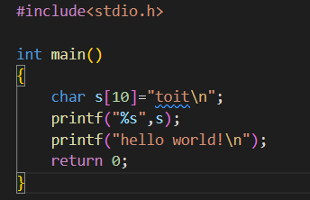
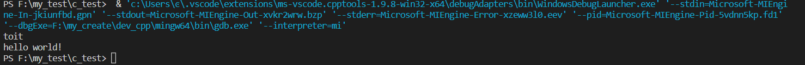

# 如何在vscode中配置c语言环境

1. 确保代码所在的路径中不含有中文；
2. 编辑launch.jason
   ```json
    {
        "version": "0.2.0",
        "configurations": [
            {
                "type": "lldb",
                "request": "launch",
                "name": "Debug",
                "program": "${fileDirname}\\${fileBasenameNoExtension}.exe",
                "args": [],
                "cwd": "${workspaceFolder}"
            }
        ]
    }
   ```
3. 编辑task.json
   ```json
     {
        "tasks": [
            {
                "type": "cppbuild",
                "label": "C/C++: gcc.exe 生成活动文件",
                "command": "F:\\my_create\\dev_cpp\\mingw64\\bin\\gcc.exe",
                "args": [
                    "-fdiagnostics-color=always",
                    "-g",
                    "${file}",
                    "-o",
                    "${fileDirname}\\${fileBasenameNoExtension}"
                ],
                "options": {
                    "cwd": "${fileDirname}"
                },
                "problemMatcher": [
                    "$gcc"
                ],
                "group": {
                    "kind": "build",
                    "isDefault": true
                },
                "detail": "调试器生成的任务。"
            }
        ],
        "version": "2.0.0"
    }   
   ```
4. 经测试可以实现正常编译与单步调试功能
   
   
   