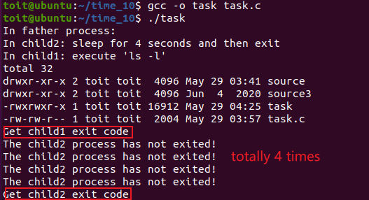

[TOC]
### linux第十次作业 进程与线程
#####  1. 什么是进程？什么是线程？Linux系统中的进程有哪些状态？进程间通信的机制有哪些？
答：
- 进程是运行中的程序，是分配地址空间的最小单元。线程则是隶属于进程的最小可并行执行单元。对于“向文件写入字符”这一进程而言，可以至少有三个独立运行的线程：获取用户输入的函数，修改文件内容的函数和将内容存放到硬盘中的函数。
- 进程可能的状态有：
  1. 运行转态 TASK_RUNNING(R);
  2. 可中断阻塞转态 TASK_INTERRUPTIBLE(S);
  3. 不可中断阻塞状态 TASK_UNINTERRUPTIBLE(D);
  4. 暂停转态 TASK_STOPPED(T);
  5. 僵死状态 EXIT_ZOMBLE(Z);
  6. 消亡状态 EXIT_DEAD(Z);
- 进程间的通信机制有：
  1. 管道(pipe):某一时刻单向，以字节流
  2. 信号(signal)：用于发送特定事件发生的信息
  3. 消息队列(message queue)：以结构体形式传输数据
  4. 信号量(semaphore)：结构体形式传输
  5. 共享内存(shared memory)：可以多台电脑访问同一内存
  6. 套接字(socket)：AF_INET(网络)与AF_UNIX(本地)
   
##### 2. 补充完善如下mp0.c代码，将WRITE_YOUR_CODE_HERE 替换成自己的代码。在该程序中，实现了3个进程，其中1个为父进程，其余2个是该父进程创建的子进程，其中一个子进程运行"ls -l"指令，另一个子进程暂停4s之后异常退出，父进程先用阻塞方式等待第一子进程的结束，然后用非阻塞方式等待另一个子进程退出，等待收集到第二个子进程结束的信息，父进程就返回。 

a. 要求作业报告中包含完整代码，并使用正确命令生成可执行命令；

b. 运行生成的可执行命令；

c. 有完整截图。

###### (1). 运行结果如图


###### (2). 修改后的代码
```c
/* mp0.c */

#include <stdio.h>

#include <stdlib.h>

#include <sys/types.h>

#include <unistd.h>

#include <sys/wait.h>


int main(void)

{

    pid_t child1, child2, child;

    

    /* Create the 1st child */

    child1 = fork();        

    /* Error processing */

    if ( child1<0 )

    {

        printf("Child1 fork error\n");

        exit(1);

    }

    else 

        if ( child1==0 ) /* Call execlp in the 1st child */

       {

           printf("In child1: execute 'ls -l'\n");

           if (execlp("ls", "ls", "-l", NULL) < 0)

           {

               printf("Child1 execlp error\n");

           }

       }

      else /* Create the 2nd child, waiting for the two processes to exit */

      {

          child2 = fork();

          if (child2 == -1) /* Error processing */

          {

              printf("Child2 fork error\n");

              exit(1);

          }

          else if( child2==0 ) /* waiting 4 seconds in the 2nd child */

          {

              printf("In child2: sleep for 4 seconds and then exit\n");

            sleep(4);

            exit(0);

        }


        printf("In father process:\n");

        child = waitpid(child1, NULL, 0); /* waiting the 1st child to exit in BLOCKed way  */

          if ( child == child1 )

          {

              printf("Get child1 exit code\n");

          }

          else

          {

              printf("Error occured!\n");

          }

          

          do

          {

              child = waitpid(child2,NULL,WNOHANG); /* waiting the 2nd child to exit in NONBLOCKed way */

              if (child == 0)

              {

                  printf("The child2 process has not exited!\n");

                  sleep(1);

              }

          } while (child == 0);

          

          if (child == child2)

        {

            printf("Get child2 exit code\n");

        }

        else

        {

            printf("Error occured!\n");

        }

    }

    return 0;

}

```

