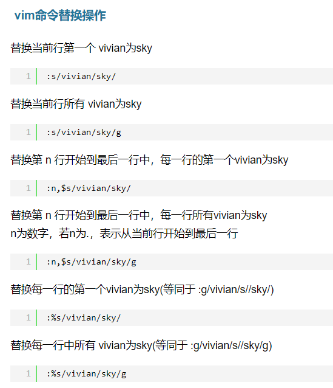

## 如何修改镜像源
1. 镜像源储存路径：/etc/apt/sources.list
2. vim的替换操作
   
   
3. 执行命令：
   ```c
   //1. 切换到目标文件
   sudo vim /etc/apt/sources.list
   //2. 将镜像源做替换
   :%s/http/https/g
   // 下载镜像源
   apt-get update
   ```