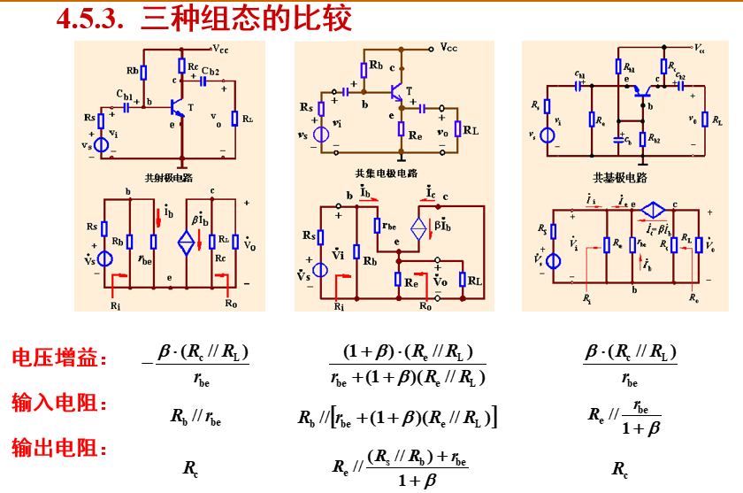

## 第四章 双极结型三极管
#### BJT小信号模型
##### 引入小信号模型的意义
答：BJT为非线性原件，但当输入的==交流信号足够小==时，可以将输入输出特性看做直线，也就是将三极管当做线性原件分析。
##### 用万用表能否直接测得$r_{be}$?
答：不能，因为：$r_{be}$是一个==交流电阻==，其值==与静态工作点有关== &ensp; $r_{be}=200\Omega+(1+\beta)\frac{26mv}{I_{EQ}}$
如果直接测量，会是一个二级管的导通电阻
#### 静态工作点的稳定问题
##### 如何降低温度对静态工作点的影响
答：加射极偏置，形成负反馈：$T\uparrow \rightarrow I_E \uparrow \rightarrow V_E \downarrow \rightarrow V_{BE}\downarrow \rightarrow I_B \downarrow \rightarrow I_E \downarrow$
#### 放大电路的三种组态
##### 三种电路的比较

特点：
1. 三种电路的输入输出电阻都很小
2. 共射放大电路是反相放大，其他两种是同相放大
#### 复合管
##### 同类复合管
可以增大输入电阻
##### 异类复合管
可以增大放大倍数，三极管类型等效为前管