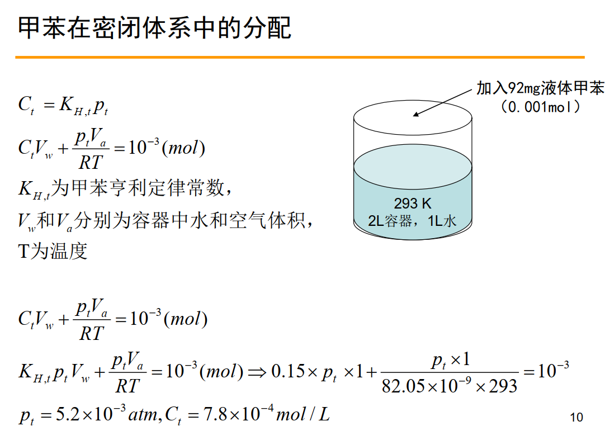
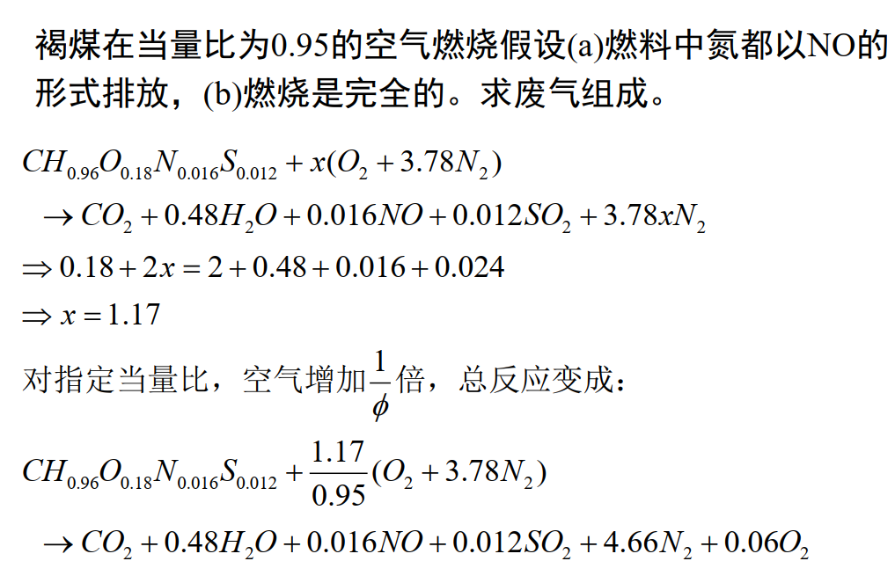
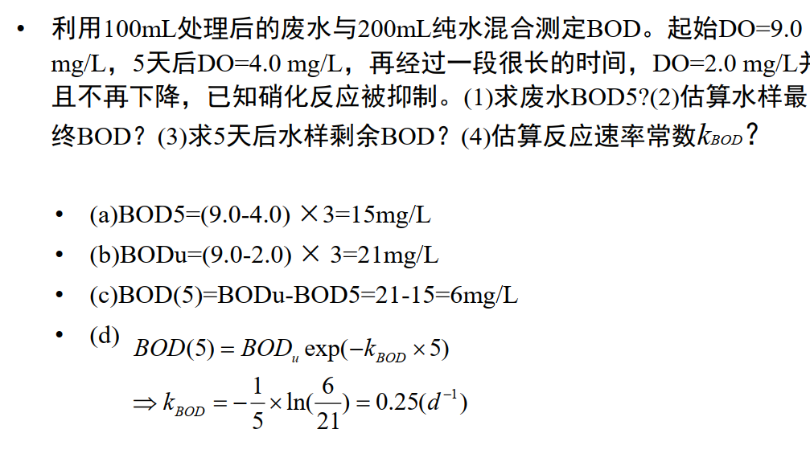
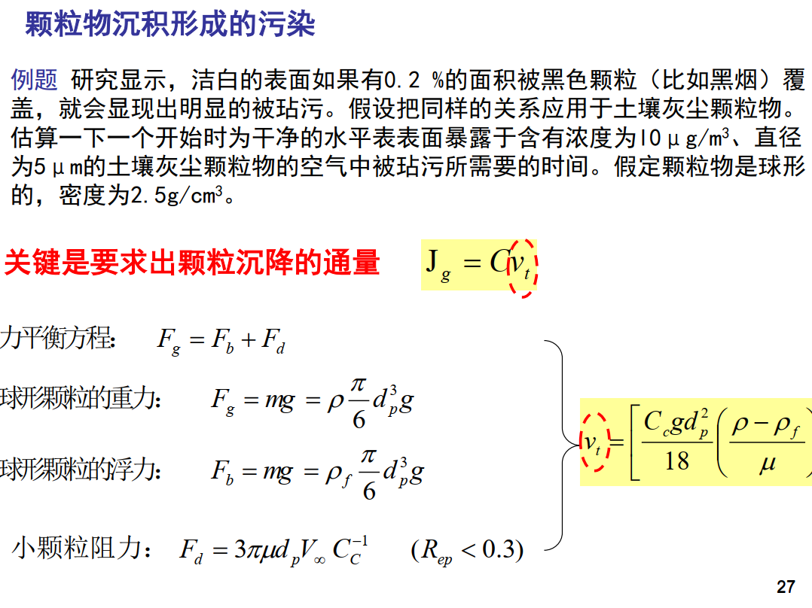
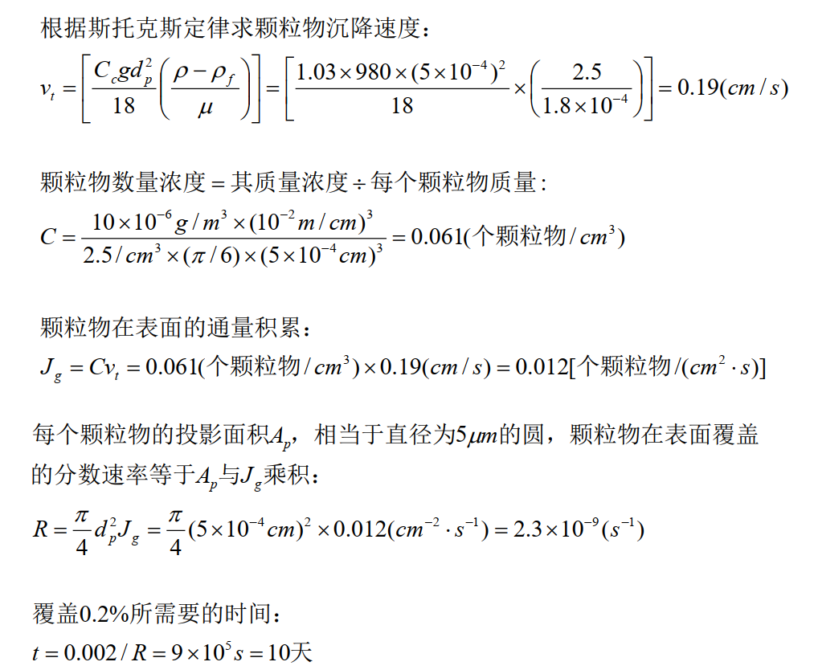
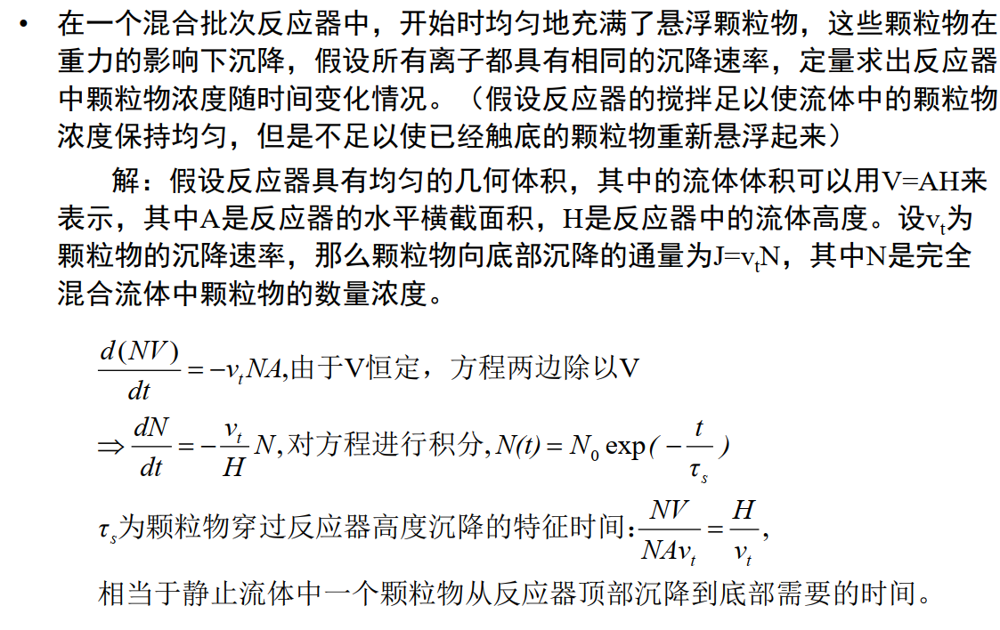

## 环境介质与杂质
#### 离子强度
$I=\sum_i c_i z_i^2$

#### 碳酸盐硬度与非碳酸盐硬度
##### 总硬度：溶液中所有钙镁离子的电荷量浓度，也成总当量浓度，用TH表示
##### 碳酸盐硬度：可以转换为难溶物的钙镁离子电荷量浓度，用CH表示
##### 非碳酸盐硬度：不可以转化为难溶物的钙镁离子的电荷量浓度，用NCH表示
##### 碳酸盐的当量浓度：碳酸根和碳酸氢根的电荷浓度
##### $1 \times 10^{-3}mol/L=1meq/L$

#### 对空气和水中的颗粒物水平进行测定
##### 空气中颗粒物质量的度量方法
1. 总悬浮颗粒物浓度(TSP):空气中单位体积内所有离子的质量
2. $PM_X$:空气中单位体积内尺寸不超过某一值的颗粒质量
3. 测定方法主要有：重量法；$\beta$射线吸收法；微量振荡天平法

## 转化过程
#### 特征时间和平衡假设
反应的速率微分方程与反应级数的关系
特征时间的意义：反应进行彻底的时间估算值，用初始浓度除以初始变换率表示

#### 蒸气压
纯液体的蒸气压等于页面上部气体分子的平衡分压
物质分压小于蒸气压，则页面趋向于继续蒸发；物质分压大于蒸气压，蒸汽趋向于冷凝

#### 甲苯在密闭体系中的分配

#### 物质的溶解度
1. NAPL(非水相液体)的溶解度取决于NAPL的种类和温度，与量无关；
2. 溶解和析出的速率与界面表面积成正比，与NAPL总量无关；
3. 平衡状态与NAPL的量、界面表面积都无关。

#### 强酸与弱酸的PH
强酸：$[H^+]=\frac {K_w}{[H^+]}+C_T$
弱酸：$pH=0.5pK_a-0.5log_{10}C_t$

#### 当量空气燃烧
##### 染料-空气质量比 
$0.0291(\frac {12n+m}{4n+m})$
##### 当量比
$\phi <1$表示贫油燃烧，$\phi>1$表示富油燃烧
方程式右侧氧气的系数：$(\frac 1\phi-1)(n+\frac m4)$
##### 例题

#### 微生物动力学
#### BOD的测量
##### 步骤
1. 测定==300ml==样品初始溶解氧DO0
2. 在20摄氏度黑暗条件下放置5天，测定溶解氧DO(5)
3. 测定5天的生化需氧量BOD5=DO0-DO5
##### 例题

## 传递和迁移
#### 扩散
分子由高浓度区域向低浓度区域的运动，称为“分子扩散”
扩散通量方向与浓度梯度相反，大小与浓度梯度成正比
#### 弥散
由于==不均匀的流动==而引起污染物的传播

扩散系数==与流体运动无关==，是污染物和流体的特性
弥散系数是==流体流场的场函数==

#### 河流中污染物的迁移
==湍流扩散==形成==横向迁移==
==平流和剪切==流形成==纵向==迁移

#### 大气中的污染物迁移
1. 主要以==垂直湍流扩散==为主
2. ==大气稳定度==会影响湍流扩散系数

#### 污染物在大气和水中的迁移
主要以边界处的==剪切流弥散==和==湍流扩散==为主；而不是分子扩散和布朗运动

#### 颗粒物的运动
##### 阻力系数与雷诺数的关系
1. ==雷诺系数==较==小==时，阻力大小值与流体的==黏度==有关
2. 雷诺系数较==大==时，阻力大小只与流体==密度==有关
##### 例题（做）

##### 沉降和扩散作用
1. 直径大的颗粒重力沉降作用大于扩散迁移作用
2. 直径小的物质扩散迁移作用大于重力扩散作用
3. 沉降作用完全去除的条件$q_v\le v_t lb$

##### 完全混合批次反应器颗粒沉降例题

##### 完全混合批次反应器以及反应
$c=\frac {c_0}{1+k_0\Theta}$

## 吸附
#### 分类
##### 物理吸附
- 由范德华力引起
- 放热过程
- 可逆
- 没有选择性
- 分子量大吸附强
##### 化学吸附
- 吸附热和反应热相近，远高于物理吸附
- 选择性强
- 属于活化吸附，温度越高吸附能力强
- 吸附得到单分子层（物理：低压单分子，高压多分子层）

#### 弗兰德里西方程
==$q=kp^{\frac 1n}$==
==吸附量随分压的增大而增多，当分压大到一定程度时 ，吸附量不再增加==

#### 吸附负荷曲线与透过曲线
==吸附负荷曲线==：以床层离进口的距离为横坐标，以吸附质的负载为纵坐标
==透过曲线==：吸附时间为横坐标，出口吸附质浓度为纵坐标

## 吸收
#### 双膜理论
相互接触的两相流体之间存在==气膜==和==液膜==，其中不存在传质阻力
膜层以外，充分湍动，不存在浓度梯度，没有传质阻力
对于难溶气体，液膜阻力较大，称为液膜控制
对于易溶气体，气膜阻力较大，称为气膜控制

#### 离子交换
1. 如果选择系数大于1，则离子交换向右进行
2. $K_{A^+}^{B^+}<1$则$B^+$优先被交换到树脂中

##### 离子交换的控制
1. 液膜扩散(外扩散)
2. 孔道扩散(内扩散)
3. 如果$He=1$则两种扩散控制都有；$He>>1$则为液膜扩散控制；$He<<1$为颗粒内扩散控制

##### 离子交换速度的影响因素
1. 离子性质：化合价、水合半径越大，扩散速率越慢
2. 树脂粒径：小的较快，但不能过于小
3. 树脂交联度：交联度高，慢
4. 离子浓度：离子浓度高，扩散快，相应的控制方式为孔道扩散控制
5. 温度
6. 流速和搅拌速率

#### 过滤
##### 过滤方程
$q^2+2q_eq=Kt$
##### 恒压过滤
$V_t^2-V_0^2=KA^2t$
$K=\frac {2\Delta p^{1-s}}{\mu_0 rf}$
##### 深层过滤
在==拦截、惯性碰撞、扩散沉淀==等作用下，颗粒附着在滤料表面上而与流体分开
##### 恒速过滤
过滤压差随时间变化

浸没度：过滤时间与旋转周期的比值

