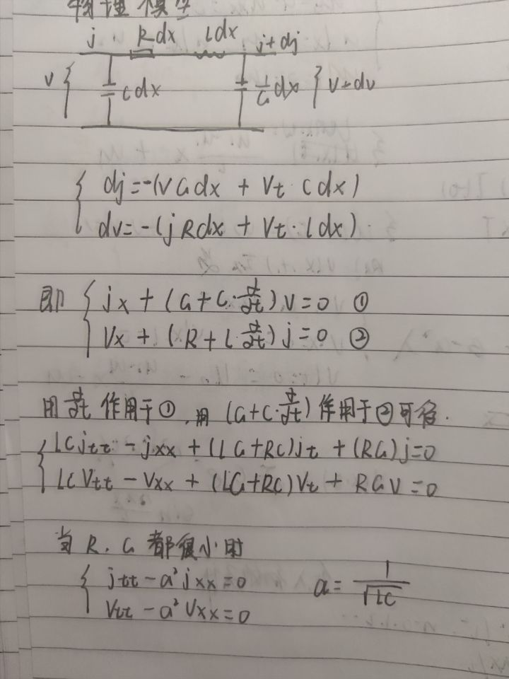

#### 常见的物理定律
##### 扩散定律：$\vec q=-D\nabla u$
##### 热传导定律：$\vec q=- k\nabla u$
#### 扩散和热传导方程建立的基本思路
1. 利用扩散定律和热传导定律表示出进入一微元的物质量或热量
2. 进入微元内的物质量可以表达为:$u_tdxdydz$;进入微元内的热量可表示为：$c \rho u_tdxdydz$
3. 两种表示方法相等可得数学物理方程
   
#### 传输电报方程的建立

