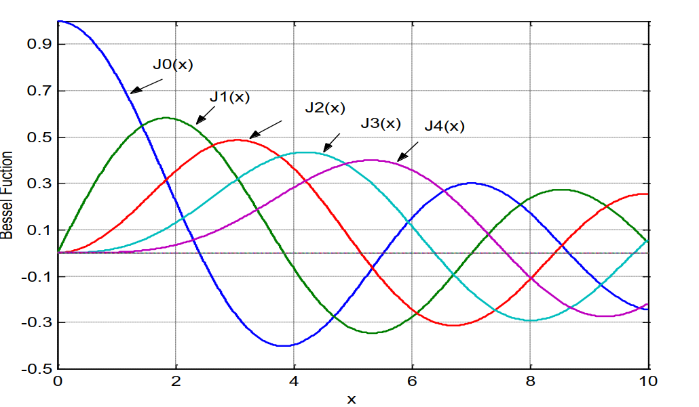
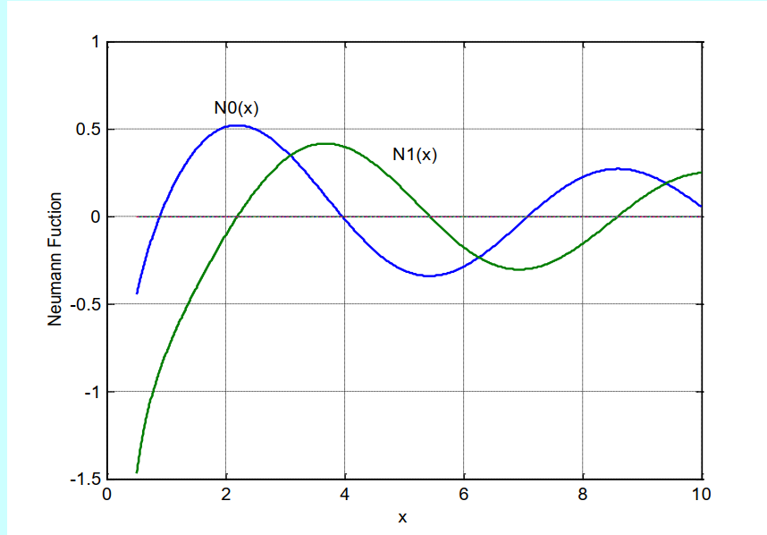
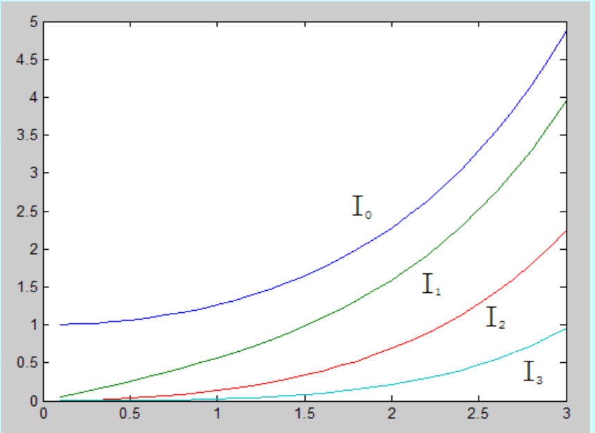
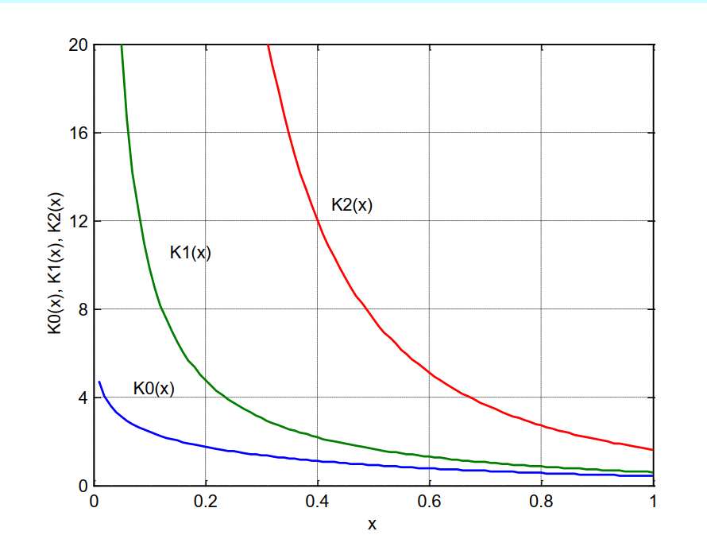

[TOC]
## 柱函数

#### 贝塞尔方程
##### 方程形式
$x^2y''+xy'+(x^2-m^2)y=0$
##### 解的形式
m解贝塞尔函数与m解诺依曼函数的组合
$y=c_1J_m(x)+c_2N_m(x)$

$J_m(x)$的图像

$N_m(x)的图像$

可见如果在0处函数值有限，则要舍去诺依曼函数

#### 虚宗量贝塞尔方程
##### 方程形式
$x^2y''+xy'-(x^2+m^2)y=0$
##### 解的形式
m阶虚宗量贝塞尔方程与m解虚宗量汉克尔方程的组合
$y=c_1I_m(x)+c_2K_m(x)$

$I_m(x)的图像$

$K_m(x)的图像$

可见，如果在0处有限，则应当舍去虚宗量汉克尔函数

#### 傅里叶-贝塞尔级数
$\begin{cases}f(\rho)=\sum_{n=1}^\infty f_n J_m(\sqrt{\mu_n^{(m)}}\rho)\\ f_n= \frac{1}{[N_n^{(m)}]^2}\int_0^{\rho_0} {f(\rho)}J_m(\sqrt{\mu_n^{(m)}}\rho)\rho d\rho \end{cases}$

其中，对于球轴对称的柱函数
第一类边界条件：${[N_n^{(0)}]^2}=\frac 12 \rho_0^2J_{1}(\sqrt{\mu_n^{(0)}}\rho)$
第二类边界条件：${[N_n^{(0)}]^2}=\frac 12 \rho_0^2J_{0}(\sqrt{\mu_n^{(0)}}\rho)$
第三类边界条件：${[N_n^{(0)}]^2}=\frac 12 (\rho_0^2+\frac{\rho_0^2}{\mu_m^{(0)}H})J_{0}(\sqrt{\mu_n^{(m)}}\rho)$

#### 柱函数的递推公式
$\frac{d}{dx}[x^vZ_v(x)]=x^vZ_{v-1}(x)$

$\frac{d}{dx}[x^{-v}Z_v(x)]=-x^{-v}Z_{v+1}(x)$

$Z_{v+1}(x)-Z_{v-1}(x)=\frac {2vZ_v(x)}{x}$

$Z_{v+1}(x)+Z_{v-1}(x)=-2Z_v'(x)$