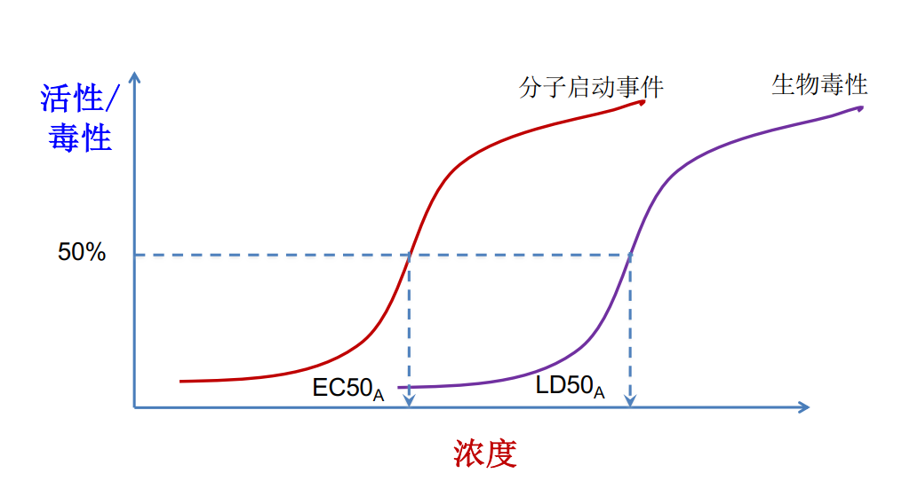

## 生物多样性与气候变化两大危机
#### 环境问题的解决方式
在以往，出现环境问题总以个人利益相关，所以解决方式多以司法机构的调节为主；但现在环境问题已经不再局限于个人利益，而是上升到了我们赖以生存的生态问题。这些问题不再依赖于人的利益，所以不能再通过司法机构调解，更多需要通过联合国调解。
## 第一章 绪论
#### 行星边界

## 第二章 环境污染物
#### 环境污染物简介

## 第四章
#### 哪些因素会影响生物富集

## AOP

可以有以下三个场景
1. 同一污染物的急性与慢性毒性
2. 不同污染物
3. 同一污染物，不同物种

毒性当量的概念

参照物的选取
选取LD50小(毒性大)的物质作为参照物
毒性大的物质当量大

#### 什么是冷凝原理 酸雨 持久性污染物的效应

#### 污染物的风险评估

