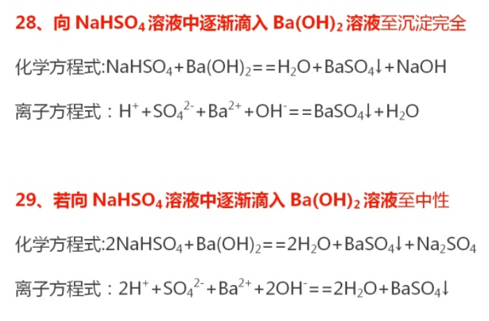
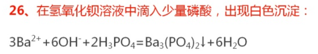

#### 问题一 $NaHSO_4$的电离
1. 在水溶液中，电离方程式为:$NaHSO_4=Na^++H^++SO_4^{2-}$。
   所以如果是书写==溶液中==电离方程式时考虑溶液中存在这==三种离子==。
2. 在熔融态下，电离方程式为:$NaHSO_4\overset{熔融}=Na^++HSO_4^-$。
   所以书写==熔融态下==的电离方程式时，考虑溶液中存在这==两种离子==。

#### 问题二 过量问题
今天下午的题型比较直接，但更需要注意的是这种==没有指明哪种过量==，而是==以实验结果==(沉淀完全、中性)为结束标志的题型。

还有这种与初次配平还有分数的，两边同时乘以一个系数，把分数化成整数就好

